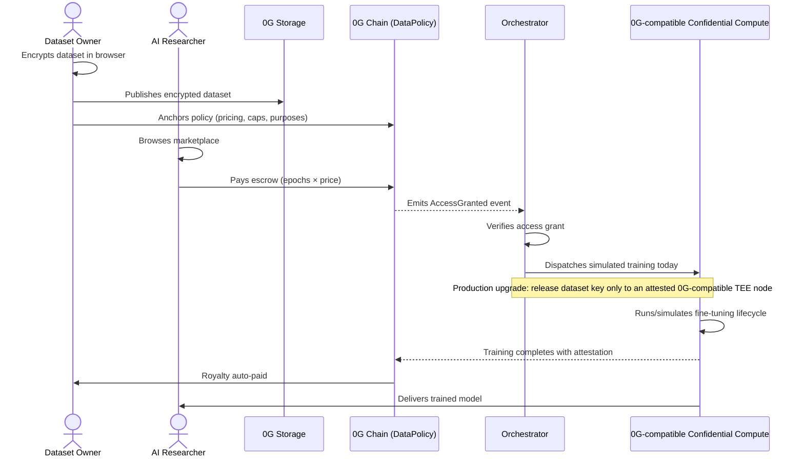

<div align="center">
  
    <h2>LICEN</h2>
  <p><b>Own, Control & Monetize your Datasets on the 0G Network</b></p>

  <a href="https://chainscan-galileo.0g.ai"></a>
  <a href="https://licen.vercel.app/docs"></a>
  
</div>

<br/>

**🎬 [Watch the Pitch & Demo Video Here](https://youtu.be/LUe9MbVv2q4)**

<br/>

**LICEN lets owners publish encrypted datasets, define enforceable usage policies around how access is granted, and earn royalties whenever approved researchers use the data for AI model training.**

---

## 🚨 The Problem

AI companies are desperate for high-quality data to train their models, but sourcing it is slow, risky, and legally murky. Independent researchers can't access premium training data at all without expensive enterprise agreements.

Meanwhile, the people who actually created that data — academic labs, biomedical institutions, independent creators — **see absolutely nothing**. Their datasets are scraped without consent, repurposed for commercial models, or locked away behind agreements that benefit no one.

Today's solution is a standard license — a PDF document. **But a license is just a PDF. You can violate a PDF. You cannot violate a smart contract.**

---

## 💡 How It Works (The Protocol)

LICEN is an end-to-end decentralized protocol. It ensures that data owners retain cryptographic control of their data until a smart contract confirms they have been paid.

### The 0G Backbone

LICEN only works because three 0G primitives work together:

- **0G Storage** gives every encrypted dataset a verifiable Merkle-root identity and stores both the encrypted dataset and the trained model output.
- **0G Chain** hosts the `DataPolicy` contract that anchors owner-defined policies, locks researcher escrow, and settles royalties automatically.
- **0G Compute** is the target execution layer for fine-tuning. The hackathon demo simulates this lifecycle today while we work toward a 0G-compatible confidential compute node that can receive dataset keys only after TEE attestation.

### A Two-Sided Platform for Data Creators and AI Researchers

**1. The Creator Secures Their Data**
A data creator (like a doctor with a medical dataset) uploads their file to LICEN. Before the file even leaves their computer, it is completely encrypted. Our servers never see the raw data, preventing any accidental leaks or scraping. The encrypted asset is then stored on **0G Storage**, which gives it a permanent Merkle-root identity.

**2. The Creator Sets the Rules**
The creator defines an on-chain usage policy for the dataset: *who can access it, how long access lasts, how much training can happen per run, how often a researcher can come back, what it costs, and which purposes are allowed*. Once set, these rules are written into the `DataPolicy` smart contract on **0G Chain** and cannot be broken, bypassed, or negotiated around by anyone.

**3. The AI Researcher Pays for Access**
An AI researcher looking for medical data browses the LICEN marketplace. They find the dataset, see the price, and pay upfront for the exact amount of training they want to do. The smart contract locks this money safely in escrow.

**4. The Model is Trained Securely**
As soon as the payment clears, LICEN automatically dispatches the training job to a secure, hardware-isolated computer network. The dataset is temporarily unlocked *only* inside this secure environment to train the AI model. The researcher never gets to download or steal the raw data itself.

**5. Everyone Gets Paid Automatically**
When the training finishes, the researcher receives their freshly trained AI model. The smart contract instantly releases the payment directly to the data creator's wallet. No invoices. No waiting 30 days. No lawyers.

<details>
<summary><b>Click to view the Data Flow Diagram</b></summary>



</details>

---

## 🌐 Why 0G?

Every 0G component used in LICEN is **load-bearing**. We didn't just slap a logo on a Web2 app; this protocol is impossible without the 0G ecosystem.

| 0G Component | Role in LICEN | Why it's absolutely necessary |
| :--- | :--- | :--- |
|  | **Encrypted dataset storage & Merkle root identity** | S3 URLs can change. 0G Storage provides content-addressed Merkle roots, the *only* way to trustlessly link a smart contract to a specific file permanently. |
|  | **DataPolicy enforcement, escrow, & settlement** | Native to the 0G ecosystem; economically viable for per-epoch micro-payments and instant settlement. |
|  | **Target fine-tuning network** | LICEN simulates the 0G Compute lifecycle today. The production path is a 0G-compatible confidential provider node with attestation-gated key release for private datasets. |

*(We also heavily utilize **Envio HyperIndex** for real-time marketplace data, making the UI orders-of-magnitude faster than raw RPC polling.)*

---

## 🚀 What's Live Today

We've built a complete, end-to-end pipeline for the hackathon. 

### ✅ Implemented Features
- [x] **DataPolicy Smart Contract:** Fully deployed and verified on the 0G Galileo Testnet ([`0x565ab137D5D18B7Aa32783C7D1a8dc29d83687E7`](https://chainscan-galileo.0g.ai/address/0x565ab137D5D18B7Aa32783C7D1a8dc29d83687E7)).
- [x] **Client-Side AES Encryption:** Dataset plaintext never touches LICEN's servers.
- [x] **ECIES Key Management:** AES keys are sealed for the Orchestrator before upload.
- [x] **0G Storage Integration:** Encrypted datasets are stored and retrieved using Merkle root identities.
- [x] **Envio HyperIndex:** Live marketplace hydration driven entirely by on-chain events.
- [x] **Orchestrator Worker:** Automated job pickup, demo-mode compute simulation, and job state tracking.
- [x] **0G Compute Lifecycle Simulation:** Full lifecycle from dispatch to settlement, designed to mirror the 0G fine-tuning user experience for the demo.
- [x] **Publisher & Researcher Dashboards:** Real-time royalty tracking, active sessions, and dataset browsing.
- [x] **Owner-Controlled Dataset Policies:** Dataset owners can define pricing, run caps, requester caps, session duration, expiry, and allowed purposes as enforceable access controls.

### 0G Compute Status and Production Upgrade

The current hackathon build **simulates 0G Compute**. This is intentional and documented because the public 0G fine-tuning path currently accepts a dataset file or 0G Storage dataset root hash, but does not expose the encrypted-dataset/key-release interface LICEN needs for the strongest privacy guarantee.

The production architecture is to run a **0G-compatible confidential compute node** operated under the same economic and audit model, but with one additional capability: **attestation-gated dataset key release**.

Production flow:

1. The owner encrypts the dataset locally and uploads only ciphertext to 0G Storage.
2. The DataPolicy contract records the dataset root, usage policy, pricing, and allowed purposes.
3. A researcher pays escrow and receives an on-chain access grant.
4. A 0G-compatible LICEN compute node starts the training container inside a TEE/CVM.
5. The node produces a remote attestation quote that binds together the hardware, container image hash, training code hash, and an ephemeral public key generated inside the TEE.
6. LICEN verifies the quote and releases the dataset AES key encrypted to that ephemeral TEE public key.
7. The dataset is decrypted only inside the confidential node, used for fine-tuning, and wiped after the run.
8. The node uploads the encrypted model artifact to 0G Storage and signs the result manifest.
9. The DataPolicy contract settles royalties using the result hash and attestation reference.

This gives LICEN a realistic path to the guarantee we want: the orchestrator coordinates policy and settlement, but does not become the long-term decryption point. Dataset keys are released only to a measured, attested, 0G-compatible training environment.

---

## 💼 Business Model Summary

LICEN is a two-sided marketplace connecting dataset owners with AI teams that need high-quality, specialized training data.

- **Customers:** On the supply side, LICEN targets academic labs, biomedical institutions, legal teams, and independent curators with valuable niche datasets. On the demand side, it serves AI startups, enterprise AI teams, and researchers who need compliant access to premium data.
- **Core value:** Creators keep control of their encrypted data by defining enforceable usage policies on **0G Chain**, storing datasets on **0G Storage**, and allowing training only through **0G Compute**. Researchers get faster legal access to specialized data, transparent provenance, and a managed training flow without handling raw infrastructure.
- **Revenue model:** LICEN takes a **2% to 5% protocol fee** on each royalty settlement. Dataset owners pay nothing upfront, and compute/network costs are passed through transparently to buyers.
- **Distribution:** Initial go-to-market focuses on direct outreach to high-value dataset creators, academic partnerships, and manual early curation to build trust and marketplace quality.
- **Expansion path:** Beyond marketplace fees, LICEN can grow into a white-labeled enterprise offering for organizations that want to run the same secure training pipeline on sensitive internal data.

### 🗺 Roadmap (Honest Limitations)
- [ ] **Native Confidential 0G-Compatible Provider:** Replace demo-mode 0G Compute simulation with a 0G-compatible node that supports encrypted dataset input, TEE attestation, and attestation-gated key release.
- [ ] **On-chain TEE Quote Verification:** Currently storing the simulated/compute task UUID as an attestation reference; upgrading to verify Intel TDX / AMD SEV-SNP quotes directly on-chain.
- [ ] **Decentralized Key Custody:** Upgrading the Orchestrator from a centralized coordinator to a Lit Protocol / Threshold Network integration or KMS policy that releases keys only after attestation.
- [ ] **Mainnet Deployment.**

---

## 🛠 Tech Stack


*   **Frontend:** Next.js, Privy (Authentication), shadcn/ui
*   **Smart Contracts:** Solidity (Foundry), deployed on 0G Chain
*   **Storage:** 0G Storage (`@0gfoundation/0g-ts-sdk`)
*   **Indexer:** Envio HyperIndex (GraphQL)
*   **Orchestrator:** Node.js, `@0gfoundation/0g-compute-ts-sdk`, Drizzle ORM
*   **Database:** Neon PostgreSQL
*   **Encryption:** AES-256-GCM (Browser) + ECIES via `@noble/curves`

---

## 💻 Getting Started

### Prerequisites
- Node.js v18+ & pnpm
- A Privy App ID
- 0G Galileo Testnet wallet with gas ([0G Faucet](https://faucet.0g.ai/))

### Installation & Setup

1. **Clone the repository**
   ```bash
   git clone https://github.com/stoneybros-projects/licen.git
   cd licen
   pnpm install
   ```

2. **Setup the Web App**
   ```bash
   cp apps/web/.env.example apps/web/.env.local
   # Fill in: PRIVY_APP_ID, OG_DATA_POLICY_ADDRESS, ORCHESTRATOR_PUBLIC_KEY
   cd apps/web && pnpm dev
   ```

3. **Setup the Orchestrator** *(in a separate terminal)*
   ```bash
   cd packages/orchestrator
   cp .env.example .env
   # Fill in: ORCHESTRATOR_PRIVATE_KEY, BACKEND_WALLET_PRIVATE_KEY, OG_COMPUTE_PRIVATE_KEY
   pnpm dev
   ```

4. **Visit the App**
   Open [http://localhost:3000](http://localhost:3000) in your browser.

📚 **[Read the Full Documentation](https://licen.vercel.app/docs)**

---

## 🔒 Security Model

We assume the server is compromised. Our architecture reflects this:

| Security Property | Enforcement Mechanism |
| :--- | :--- |
| **Datasets stay encrypted until payment** | The AES key is only eligible for release after the on-chain `Granted` state is verified. In the demo, this is simulated/coordinated by the Orchestrator; in production, release is gated by TEE attestation from a 0G-compatible confidential node. |
| **Policy cannot be bypassed** | The `DataPolicy` smart contract rejects requests that violate owner-defined controls like epoch caps, requester caps, session windows, expiry, and allowed purposes. |
| **Royalties are guaranteed** | Settlement is executed via smart contract state transitions — absolutely no invoicing or trust required. |
| **Zero-knowledge web backend** | Thanks to ECIES, the web server and database cannot decrypt AES keys or access plaintext data. The production compute upgrade removes the Orchestrator as a plaintext handling point by releasing keys only to an attested TEE. |

---

<div align="center">
  <p>Built for the <b>0G APAC Hackathon 2026</b> 🚀</p>
  <p>MIT License</p>
</div>
