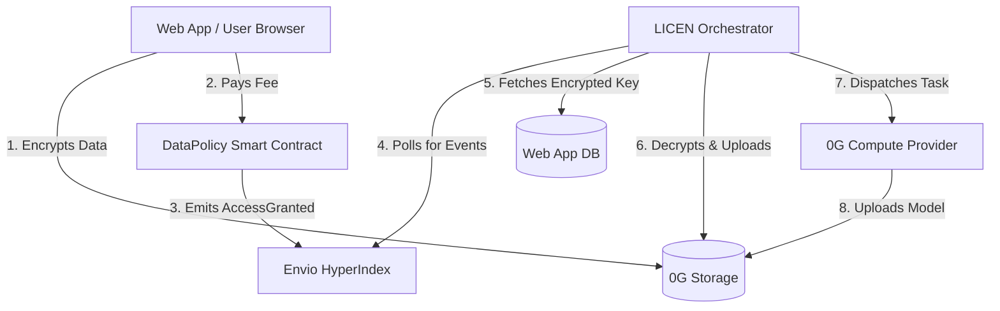

# System Overview

LICEN is not a single monolithic application. It is a suite of microservices designed to securely pass encrypted data and payment authorizations across trust boundaries without relying on a central, trusted server.

## Architecture Diagram

## The Components

### 1. The Web Application (Frontend & API)
Built with **Next.js**, this is the user-facing application. 
*   **Client-Side:** Handles wallet connections, in-browser dataset encryption (AES + ECIES), and interacting with the smart contract.
*   **Server-Side:** Acts as a secure store for the "Encrypted Key Envelopes" in a PostgreSQL database (Neon).

### 2. The Smart Contract
Deployed on the 0G Testnet EVM, `DataPolicy.sol` acts as the financial arbiter.
*   It records dataset pricing.
*   It accepts payments from researchers and routes them to providers.
*   It emits an immutable `AccessGranted` event that triggers the compute workflow.

### 3. The Indexer (Envio HyperIndex)
Instead of forcing the Orchestrator to scan every block on the blockchain, the **Envio Indexer** provides a high-performance GraphQL API.
*   It listens exclusively for `AccessGranted` events on the `DataPolicy` contract.
*   It structures this data so the Orchestrator can easily query "What jobs are pending?"

### 4. The Orchestrator
This is the "Brain" of the backend infrastructure. It is a long-running Node.js background process.
*   **Secure:** It is the *only* entity that holds the ECIES private key required to unseal the dataset decryption keys.
*   **Automated:** It polls the Indexer, fetches the key envelope from the Web App API, decrypts the dataset in memory, and dispatches the task to the **0G Compute Network**.
*   **Stateful:** It maintains a local database table (`compute_jobs`) to track the progress of long-running GPU tasks.

### 5. 0G Storage & Compute
The underlying decentralized infrastructure provided by the 0G Foundation.
*   **Storage:** Hosts the encrypted datasets uploaded by users, the temporary plaintext datasets required for compute, and the final trained models.
*   **Compute:** A network of GPU providers that pick up the dispatched fine-tuning tasks.
