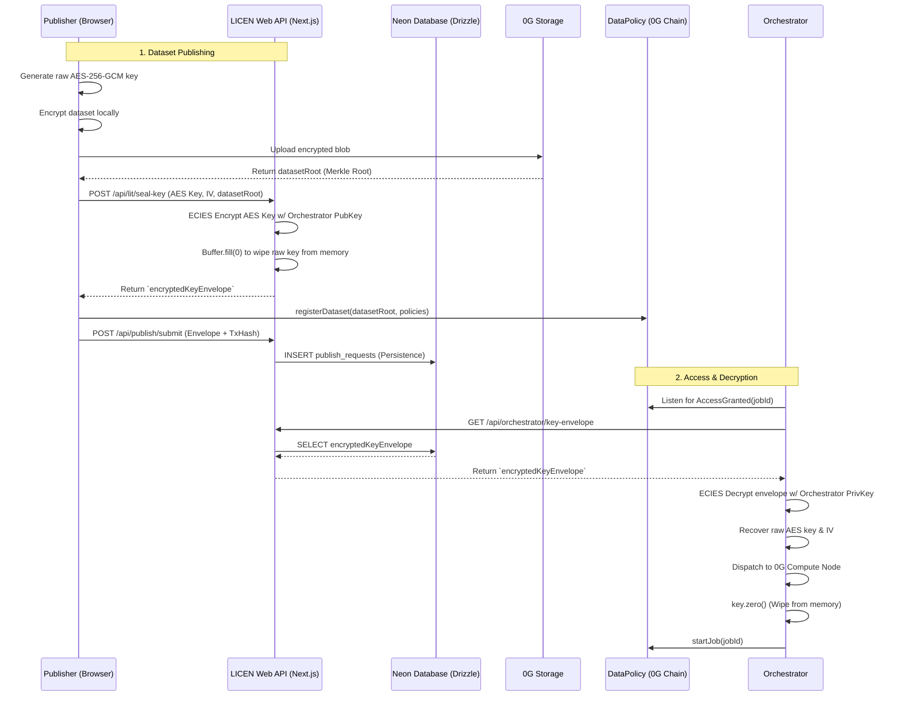

# Key Management System: Implementation Report

## Overview
This document provides a comprehensive breakdown of the newly implemented Key Management phase for the LICEN protocol. The system has transitioned from a vulnerable, client-side raw AES key model to a production-grade **ECIES Envelope Encryption** architecture. 

This model ensures that cryptographic keys used to encrypt datasets are securely custodied, never exposed to the frontend, and explicitly managed with zero-knowledge principles during transit and compute dispatch.

---

## 1. Architectural Flow

The key management flow relies on a strict boundary between the Client (Browser), the LICEN Web API (Server), and the Orchestrator.

---

## 2. Cryptographic Implementation (ECIES)

The core encryption relies on the Elliptic Curve Integrated Encryption Scheme (ECIES) over the `secp256k1` curve. We utilized `@noble/curves` (v2 API) and `@noble/hashes` for a pure JavaScript, zero-dependency cryptographic implementation that safely runs inside Next.js Edge/Node environments.

### Envelope Structure
The resulting `encryptedKeyEnvelope` is a tightly packed byte array hex-encoded for storage. It concatenates the following components:

| Byte Range | Length | Component | Description |
| :--- | :--- | :--- | :--- |
| `0 - 32` | 33 bytes | Ephemeral Public Key | Compressed secp256k1 public key unique to this specific encryption instance. |
| `33 - 44` | 12 bytes | AES-GCM IV | Initialization Vector for the symmetric cipher. |
| `45 - 60` | 16 bytes | Auth Tag | AES-256-GCM Authentication Tag ensuring payload integrity. |
| `61 - 105` | 44 bytes | Ciphertext | The encrypted payload (32 bytes AES Key + 12 bytes original IV). |

### Cryptographic Operations
1. **Key Exchange (ECDH):** An ephemeral `secp256k1` keypair is generated. A shared secret is derived using the ephemeral private key and the Orchestrator's public key.
2. **Key Derivation:** The x-coordinate of the shared secret is passed through HKDF-SHA256 to derive a 32-byte symmetric encryption key.
3. **Symmetric Encryption:** The raw dataset AES key is encrypted using AES-256-GCM with the derived symmetric key.

---

## 3. Strict Security Invariants

We designed this architecture specifically to enforce the following production security invariants:

> [!CAUTION]
> **Zero Client-Side Exposure**
> The raw AES key is generated in the browser for local file encryption, but it is **never** stored locally, logged, or returned from the API. Once it is sent to `/api/lit/seal-key`, the client completely discards it.

> [!IMPORTANT]
> **Explicit Memory Wiping**
> Node.js garbage collection is non-deterministic, meaning cryptographic secrets can linger in memory dumps. We implemented explicit `.fill(0)` calls on all `Buffer` and `Uint8Array` instances holding raw AES keys inside both the Web API (`sealAesKey`) and the Orchestrator (`unsealDatasetKey`).

> [!NOTE]
> **Key Isolation**
> The `ORCHESTRATOR_PRIVATE_KEY` is completely isolated. It exists only in the `.env` of the Orchestrator service and the Next.js backend. It is never exposed via `NEXT_PUBLIC_` variables.

---

## 4. Persistence Layer Upgrade

During the final phase of implementation, we identified a critical failure point: the Next.js API was using an in-memory `Map` to store the `encryptedKeyEnvelope` mappings.

We resolved this by implementing **Drizzle ORM** with the **Neon Database Serverless** integration:
- Created the `publish_requests` table mapping `requestId` and `datasetRoot` to the `encryptedKeyEnvelope`.
- Initialized `@neondatabase/serverless` using `neon-http` to prevent connection pooling exhaustion in Vercel's serverless environment.
- Refactored `src/lib/publish/store.ts` to utilize asynchronous database queries (`db.insert`, `db.update`, `db.query`).
- Type-checked the entire integration using strict `tsc --noEmit`, ensuring 100% type safety.

---

## 5. Upgrade Path: Lit Protocol & Decentralization

The current architecture acts as a highly secure, centralized "V1". However, it has been architected strictly to allow a drop-in upgrade to decentralized threshold cryptography (e.g., Lit Protocol or Threshold Network) without breaking the client.

### How the upgrade works:
1. **No Client Changes:** The publish frontend still calls `POST /api/lit/seal-key`. The client does not care how the key is sealed.
2. **Web API Update:** Inside the route handler, instead of using our local ECIES implementation, we call the Lit Protocol SDK to encrypt the key to an Access Control Condition (ACC) targeting the `DataPolicy.sol` smart contract.
3. **Orchestrator Update:** The orchestrator drops its local private key. When a job is granted, the orchestrator requests decryption from the Lit Network. Lit Nodes verify the on-chain `AccessGranted` state and return the decrypted AES key.

This ensures that moving to a decentralized key management network will require **zero** database migrations and **zero** user-facing frontend changes.
